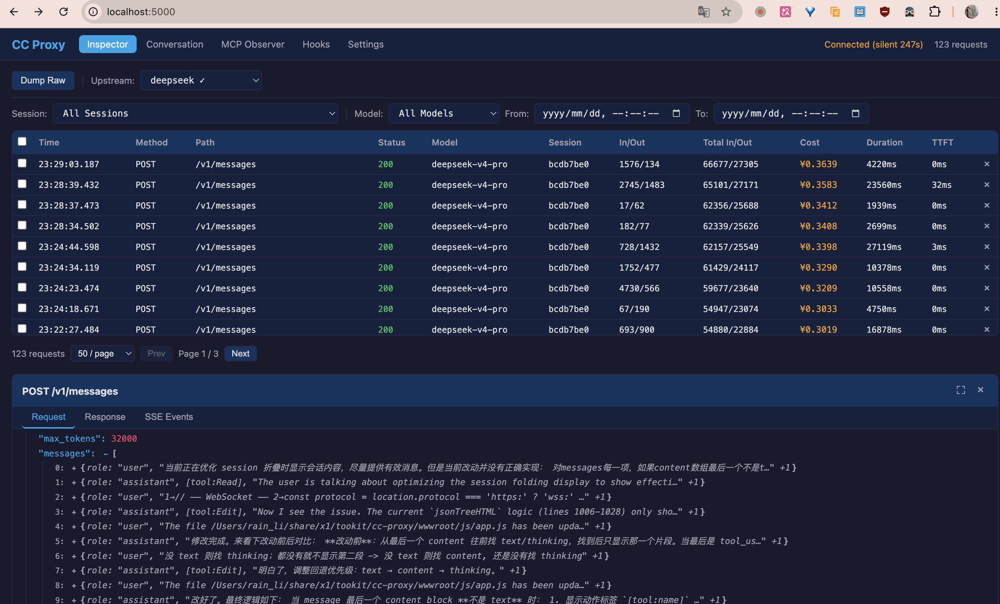

# CC Proxy

Claude Code API 透明代理 — 拦截、可视化、分析 AI Coding Agent 的 API 流量。支持多 Provider 切换、Tier 路由、费用统计、会话回放。



## 安装

### 1. 构建

```bash
# 需要 Rust 1.80+
git clone https://github.com/tndata/cc-proxy.git
cd cc-proxy

cargo build -p proxy-server --release
cargo build -p proxy-hook-agent --release
```

### 2. 配置 Claude Code

将 `settings.json` 复制到 `~/.claude/`：

```bash
cp settings.json ~/.claude/
```

或者手动配置环境变量：

```bash
export ANTHROPIC_BASE_URL="http://localhost:8888"
```

### 3. 启动代理

```bash
./target/release/proxy-server config.toml
```

### 4. 打开仪表盘

浏览器访问 **http://localhost:5000**

## 使用流程

```
Claude Code ──► :8888 代理 ──► 上游 Provider（DeepSeek / Anthropic / 自定义）
浏览器    ──► :5000 仪表盘 ──► 实时查看请求、切换 Provider、查看费用
Claude Code ──► :9999 MCP 代理
```

### 配置 Provider

1. 打开仪表盘 → **Settings** 标签
2. 点击 **Add Provider**，填入名称、API 地址、API Key
3. 添加该 Provider 支持的模型及价格（¥/百万 token），用于费用统计
4. 可以添加多个 Provider（如 DeepSeek、Anthropic、第三方代理）

### 切换 Provider

1. 仪表盘 → **Settings** → 点击 **Add Upstream**
2. 配置 Tier 路由规则：
   - **High** — 匹配 `opus` 等关键词 → 路由到指定 Provider/Model
   - **Mid** — 匹配 `sonnet` 等关键词
   - **Low** — 匹配 `haiku` 等关键词
   - **Default** — 都不匹配时的回退
3. 点击 **Activate** 切换，立即生效

也可以在 Inspector 顶部下拉框快速切换已配置的 Upstream。

### 查看费用

- **Inspector** 表格的 **Cost** 列显示每个请求的费用（根据 Provider 模型价格计算）
- 费用 = 累计输入 token × 输入单价 + 累计输出 token × 输出单价
- Settings 中可为每个模型设置 `price_per_million_input` / `price_per_million_output`（单位：¥/百万 token）

### 了解会话内容

- 点击 Inspector 表格中的任意请求行 → 展开详情面板
  - **Request** — 请求 headers + body（JSON 树形展开，messages 折叠显示摘要）
  - **Response** — 响应 headers + body
  - **SSE Events** — 流式事件逐条展示
- **Conversation** 标签 — 实时对话时间线，混合展示 API 请求、Hook 事件、MCP 调用
- 按 Session 筛选可聚焦单次会话

## 仪表盘功能

| 标签 | 功能 |
|------|------|
| **Inspector** | 请求表格（分页/筛选/多选删除），表头: Time/Method/Path/Status/Model/Session/In·Out/Cost/Duration/TTFT |
| **Conversation** | 实时时间线（API + Hook + MCP 混合，按 session 过滤） |
| **MCP Observer** | MCP JSON-RPC 请求列表 + 目标地址配置 |
| **Hooks** | Hook 事件表格 |
| **Settings** | Providers 管理（含模型价格）+ Upstreams 管理（High/Mid/Low/Default 四层 Tier 路由） |

## 端口

| 端口 | 用途 |
|------|------|
| **5000** | 仪表盘 SPA + REST API + WebSocket |
| **8888** | Anthropic API 透明代理 |
| **9999** | MCP JSON-RPC 透明代理 |

## 配置参考

```toml
# config.toml
[logging]
level = "info"

[proxy]
active_upstream = "deepseek"

[[proxy.providers]]
name = "deepseek"
url = "https://api.deepseek.com/anthropic"
token = "sk-xxx"

[[proxy.providers.models]]
id = "deepseek-v4-pro"
price_per_million_input = 3.0
price_per_million_output = 6.0

[[proxy.upstreams]]
name = "deepseek"
default_provider = "deepseek"
default_model = "deepseek-v4-pro"

[proxy.upstreams.high]
keywords = ["opus"]
provider = "deepseek"
model = "deepseek-v4-pro"

[server]
http_port = 5000
proxy_port = 8888
mcp_proxy_port = 9999
listen_address = "127.0.0.1"
```

详细配置见 `config.toml.template`。

## 安全

- 所有端口仅监听 `127.0.0.1`
- `x-api-key`、`Authorization` header 自动脱敏为 `[REDACTED]`
- API token 存本地 TOML 文件，前端仅展示 `has_token: bool`
- 数据存本地 SQLite（`data.db`），不对外暴露

## License

MIT
